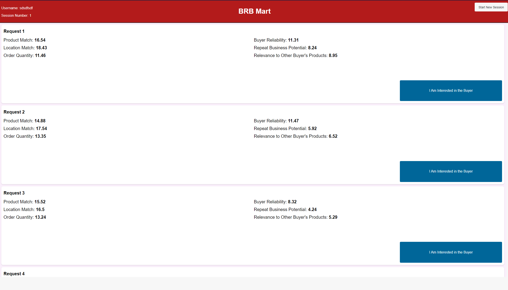

<!-- Improved compatibility of back to top link: See: https://github.com/othneildrew/Best-README-Template/pull/73 -->
<a name="readme-top"></a>
<!--
*** Thanks for checking out the Best-README-Template. If you have a suggestion
*** that would make this better, please fork the repo and create a pull request
*** or simply open an issue with the tag "enhancement".
*** Don't forget to give the project a star!
*** Thanks again! Now go create something AMAZING! :D
-->


<!-- PROJECT SHIELDS -->
<!--
*** I'm using markdown "reference style" links for readability.
*** Reference links are enclosed in brackets [ ] instead of parentheses ( ).
*** See the bottom of this document for the declaration of the reference variables
*** for contributors-url, forks-url, etc. This is an optional, concise syntax you may use.
*** https://www.markdownguide.org/basic-syntax/#reference-style-links
-->
[![Contributors][contributors-shield]][contributors-url]
[![Forks][forks-shield]][forks-url]
[![Stargazers][stars-shield]][stars-url]
[![Issues][issues-shield]][issues-url]
[![MIT License][license-shield]][license-url]


<!-- PROJECT LOGO -->
<br />
<div align="center">
  <a href="https://github.com/scrollnudge">
    
  </a>

<h3 align="center">Scroll Nudge Experiment</h3>

  <p align="center">
    When given imperfectly ranked search results, will users interact more when given a nudge prior to the search?
    <br /> 
    <a href="https://github.com/scrollnudge"><strong>Explore the docs »</strong></a>
    <br />
    <br />
    <a href="https://github.com/scrollnudge">View Demo</a>
    ·
    <a href="https://github.com/scrollnudge/issues">Report Bug</a>
    ·
    <a href="https://github.com/scrollnudge/issues">Request Feature</a>
  </p>
</div>


<!-- TABLE OF CONTENTS -->
<details>
  <summary>Table of Contents</summary>
  <ol>
    <li>
      <a href="#about-the-project">About The Project</a>
      <ul>
        <li><a href="#built-with">Built With</a></li>
      </ul>
    </li>
    <li>
      <a href="#getting-started">Getting Started</a>
      <ul>
        <li><a href="#prerequisites">Prerequisites</a></li>
        <li><a href="#installation">Installation</a></li>
      </ul>
    </li>
    <li><a href="#usage">Usage</a></li>
    <li><a href="#license">License</a></li>
    <li><a href="#contact">Contact</a></li>
    <li><a href="#acknowledgments">Acknowledgments</a></li>
  </ol>
</details>


<!-- ABOUT THE PROJECT -->
## About The Project



Context: The paper aims to study how ranking quality affects seller behavior on a B2B platform. The platform arranges buyer requests sequentially on a seller’s log in page. When the seller logs in, they view requests sequentially starting from the top and click on a button called “contact buyer” if they want to transact with the buyer. The platform generates revenue from the number of times the seller clicks on the “contact buyer” button. The platform is making investments to improve ranking quality, i.e., it wants to show buyer requests that have the highest value to the seller at the top of the page.

Empirical results from my paper thus far show that as the platform improves ranking quality, sellers decrease the number of positions viewed on the page, i.e., they do not scroll deep. While this is a good outcome for the seller as they spend less effort on the platform, it may lead to lost usage for the platform, i.e., since the seller is not scrolling deep, there is a possibility of there being a request that the seller would have liked (or clicked “contact buyer” button) if only they had seen it.

To overcome this possibility, we are recommending the platform to accompany their investments in improving ranking quality with scroll nudges. A scroll nudge is a prompt to the seller to scroll at least up to a certain position number before ending a session. We want to test this strategy using an experiment at different levels of ranking quality.

**Goal: Study the impact of scroll nudges on the number of “contact buyer” clicks and views of the seller at different levels of ranking quality.**

## Experiment design
Experiment design: We two groups of participants as follows:

1. without a scroll nudge

2. with a scroll nudge

Each participant will be asked to play 30 rounds. In each round we will show a list of 500 requests each and the participant is asked to find all buyer requests which have a value greater than a threshold V (= 75). Among the 30 rounds, 10 will have perfect ranking, 10 will have partial ranking and 10 will have random ranking. The sequence in which the perfect, partial and random ranking are shown can be randomly generated with the following conditions met.

1. Among the first 6, there must be 2 partial, 2 perfect and 2 random sequences

2. Among the last 6, there must be 2 partial, 2 perfect and 2 random sequences

The rest can be sequenced randomly.


Compensation: Participants will be paid a fixed fee to participate, and a small compensation based on the number of requests they find with a value greater than V.

How do we rank: We consider that the value of each buyer request for a seller comes from four features, say x1, x2, x3, x4, x5, x6. The value from each feature is randomly drawn from uniform distributions U(1,17), U(1,19), U(1,14), U(1,19), U(1,17), U(1,14) respectively. The total value of a request for a seller is the sum of values from all the features.

Perfect ranking: We obtain this by sorting requests based on total value

Partial ranking: We obtain this by sorting requests based on value from only A and C

Random ranking: We do not sort.


<p align="right">(<a href="#readme-top">back to top</a>)</p>


### Built With

* [![Python Badge][python]][python-url]
* [![Raspberry Pi Badge][flask]][rpi-url]

<p align="right">(<a href="#readme-top">back to top</a>)</p>

### Prerequisites

Create a virtual environment with 
* ```sh
  python3 -m venv venv
  ```
Activate the environment
* ```sh
  .\venv\Scripts\activate
  ```

Or, if you're using Linux:
* ```sh
  source venv/bin/activate
  ```


* ```sh
  pip3 install -r requirements.txt
  ```
* run `python wsgi.py`

<p align="right">(<a href="#readme-top">back to top</a>)</p>


See the [open issues](https://github.com/scrollnudge/issues) for a full list of proposed features (and known issues).

<p align="right">(<a href="#readme-top">back to top</a>)</p>


<!-- CONTRIBUTING -->
## Contributing

Contributions are what make the open source community such an amazing place to learn, inspire, and create. Any contributions you make are **greatly appreciated**.

If you have a suggestion that would make this better, please fork the repo and create a pull request. You can also simply open an issue with the tag "enhancement".
Don't forget to give the project a star! Thanks again!

1. Fork the Project
2. Create your Feature Branch (`git checkout -b feature/AmazingFeature`)
3. Commit your Changes (`git commit -m 'Add some AmazingFeature'`)
4. Push to the Branch (`git push origin feature/AmazingFeature`)
5. Open a Pull Request

<p align="right">(<a href="#readme-top">back to top</a>)</p>


<!-- LICENSE -->
## License

Distributed under the MIT License. See `LICENSE.txt` for more information.

<p align="right">(<a href="#readme-top">back to top</a>)</p>


<!-- CONTACT -->
## Contact

Geneustace Wicaksono - [My Website](https://genewica.herokuapp.com) - geneustacewicaksono@yahoo.com

Project Link: [https://github.com/scrollnudge](https://github.com/scrollnudge)

<p align="right">(<a href="#readme-top">back to top</a>)</p>


<!-- ACKNOWLEDGMENTS -->
## Acknowledgments

* [Rakesh Allu](https://sites.google.com/view/rakeshallu/home)
* [Vishal Gaur](https://business.cornell.edu/faculty-research/faculty/vg77/)

<p align="right">(<a href="#readme-top">back to top</a>)</p>


<!-- MARKDOWN LINKS & IMAGES -->
<!-- https://www.markdownguide.org/basic-syntax/#reference-style-links -->
[contributors-shield]: https://img.shields.io/github/contributors/Sentientplatypus/octane7.svg?style=for-the-badge
[contributors-url]: https://github.com/scrollnudge/graphs/contributors
[forks-shield]: https://img.shields.io/github/forks/Sentientplatypus/octane7.svg?style=for-the-badge
[forks-url]: https://github.com/scrollnudge/network/members
[stars-shield]: https://img.shields.io/github/stars/Sentientplatypus/octane7.svg?style=for-the-badge
[stars-url]: https://github.com/scrollnudge/stargazers
[issues-shield]: https://img.shields.io/github/issues/Sentientplatypus/octane7.svg?style=for-the-badge
[issues-url]: https://github.com/scrollnudge/issues
[license-shield]: https://img.shields.io/github/license/Sentientplatypus/octane7.svg?style=for-the-badge
[license-url]: https://github.com/scrollnudge/blob/master/LICENSE.txt
[linkedin-shield]: https://img.shields.io/badge/-LinkedIn-black.svg?style=for-the-badge&logo=linkedin&colorB=555
[linkedin-url]: https://linkedin.com/in/linkedin_username
[product-screenshot]: images/rig.png
[jumper]: images/jumper.png
[body]: images/body.png
[python]: https://img.shields.io/badge/Python-3776AB?style=for-the-badge&logo=python&logoColor=white
[python-url]: https://python.com
[flask]: https://img.shields.io/badge/Flask-000000?style=for-the-badge&logo=flask&logoColor=white
[rpi-url]: https://raspberrypi.com
